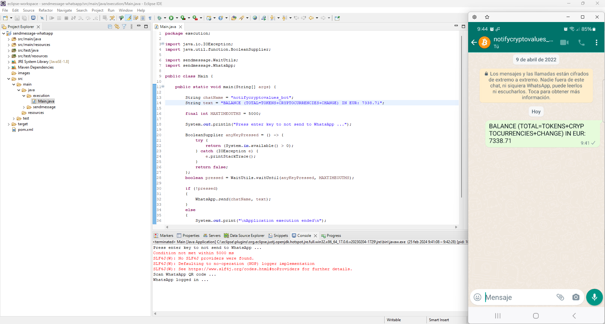

# sendmessage-whatsapp

How to use Java/Selenium WebDriver to send WhatsApp messages automatically

## Application context

Selenium is an open-source tool that automates Web browsers. It provides a single interface that lets you write test scripts in programming languages like Java, among others.

## Implementation

Basically, I create 4 Java files. 

In:  
execution\ folder  
* Main.java

In:  
sendmessage\ folder  
* Unit.java
* WaitUtils.java
* WhatsApp.java

Additionally, a pom.xml configuration file of the project is created. It is a XML file that contains information about the project and configuration details used by Maven to build the project.
This project also uses https://github.com/bonigarcia/webdrivermanager instead of chromedriver.

## Usage

I will send a WhatsApp message using Java/Selenium WebDriver by automating a Google Chrome browser to interact with the WhatsApp Web interface.

In:  
[sendmessage-whatsapp\src\main\java\execution\Main.java](src/main/java/execution/Main.java)

Edit the variables chatName and text:
```
public static void main(String[] args) {

	String chatName = "to complete";
	String text = "to complete";
```

Run Main.java

The following screenshot shows the results with these variable values:
```
public static void main(String[] args) {

	String chatName = "notifycryptovalues_bot";
	String text = "BALANCE (TOTAL=TOKENS+CRYPTOCURRENCIES+CHANGE) IN EUR: 7338.71";
```    


If you build the project with Maven a .jar extension file called sendmessage-whatsapp-0.0.1-SNAPSHOT-jar-with-dependencies will be generated in target\ folder.

To execute it, you could open a new terminal in target\ folder and type:
```
java -jar sendmessage-whatsapp-0.0.1-SNAPSHOT-jar-with-dependencies.jar
```

## Deliverable

that includes:

Java EE Eclipse project with the source code. You should use Maven build because the project is clean.

Download the files as a zip using the green button, or clone the repository to your machine using Git.
